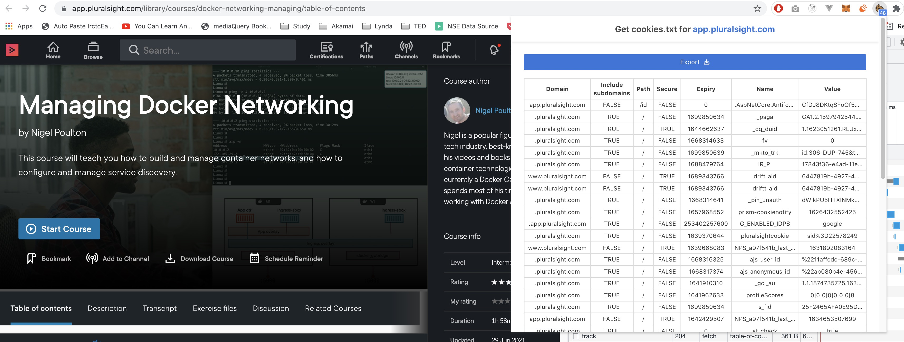

# Download Pluralsight Videos

- Login into Pluralsight.com using your Username and Password.
- Install following `Get cookies.txt` Chrome extension (https://chrome.google.com/webstore/detail/get-cookiestxt/bgaddhkoddajcdgocldbbfleckgcbcid)
- Now go to Pluralsight page and export the cookie using `Get cookies.txt` Chrome extension



- Next create cookies.txt file and paste export cookie content in it.
- Now use following `youtube-dl` command to download videos


### Download with subtitle

```bash
youtube-dl --cookies "./cookies.txt" --user-agent "Mozilla/5.0 (Macintosh; Intel Mac OS X 10_15_7) AppleWebKit/537.36 (KHTML, like Gecko) Chrome/95.0.4638.69 Safari/537.36" --sleep-interval 35 --max-sleep-interval 120 --all-subs --sub-format srt --write-sub --verbose https://app.pluralsight.com/library/courses/docker-networking-managing
```

### Download without subtitle

```bash
youtube-dl --cookies "./cookies.txt" --user-agent "Mozilla/5.0 (Macintosh; Intel Mac OS X 10_15_7) AppleWebKit/537.36 (KHTML, like Gecko) Chrome/95.0.4638.69 Safari/537.36" --sleep-interval 35 --max-sleep-interval 120  --verbose https://app.pluralsight.com/library/courses/docker-networking-managing
```

### Video Start, End & Specific Videos Download

Video Selection:
    --playlist-start NUMBER              Playlist video to start at (default is 1)
    --playlist-end NUMBER                Playlist video to end at (default is last)
    --playlist-items ITEM_SPEC           Playlist video items to download. Specify indices of the videos in the playlist separated by commas like: "--playlist-items 1,2,5,8" if you want to download videos indexed 1, 2, 5,
                                         8 in the playlist. You can specify range: "--playlist-items 1-3,7,10-13", it will download the videos at index 1, 2, 3, 7, 10, 11, 12 and 13.
